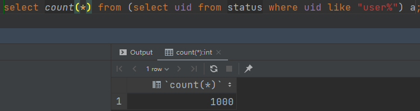

* 测试过程中服务器各自在一个容器中运行

## product, database服务测试
1. 获取全部商品[AllProduct](./tests/script/AllProduct.java)

1000 用户的测试结果如下
```shell
================================================================================
---- Global Information --------------------------------------------------------
> request count                                       1000 (OK=1000   KO=0     )
> min response time                                    781 (OK=781    KO=-     )
> max response time                                  24449 (OK=24449  KO=-     )
> mean response time                                 15022 (OK=15022  KO=-     )
> std deviation                                       6405 (OK=6405   KO=-     )
> response time 50th percentile                      15459 (OK=15459  KO=-     )
> response time 75th percentile                      20198 (OK=20198  KO=-     )
> response time 95th percentile                      23686 (OK=23686  KO=-     )
> response time 99th percentile                      24329 (OK=24329  KO=-     )
> mean requests/sec                                 38.462 (OK=38.462 KO=-     )
---- Response Time Distribution ------------------------------------------------
> t < 800 ms                                             1 (  0%)
> 800 ms < t < 1200 ms                                   5 (  1%)
> t > 1200 ms                                          994 ( 99%)
> failed                                                 0 (  0%)
================================================================================
```
每次的返回全部的2000+条商品数据，可以看出相应速度较慢，因此在用户请求时必须使用back pressure机制依次返回。

2. 按照asin查找某个商品[GetProduct]()

1000 用户测试结果如下
```shell
================================================================================
---- Global Information --------------------------------------------------------
> request count                                       1000 (OK=1000   KO=0     )
> min response time                                    553 (OK=553    KO=-     )
> max response time                                   3477 (OK=3477   KO=-     )
> mean response time                                  2025 (OK=2025   KO=-     )
> std deviation                                        741 (OK=741    KO=-     )
> response time 50th percentile                       2025 (OK=2025   KO=-     )
> response time 75th percentile                       2678 (OK=2678   KO=-     )
> response time 95th percentile                       3103 (OK=3103   KO=-     )
> response time 99th percentile                       3255 (OK=3255   KO=-     )
> mean requests/sec                                    200 (OK=200    KO=-     )
---- Response Time Distribution ------------------------------------------------
> t < 800 ms                                            77 (  8%)
> 800 ms < t < 1200 ms                                  85 (  9%)
> t > 1200 ms                                          838 ( 84%)
> failed                                                 0 (  0%)
================================================================================
```

## cart, order, database服务测试
1. 1000 用户使用cart[BasicCart]()
```shell
================================================================================
---- Global Information --------------------------------------------------------
> request count                                       3000 (OK=3000   KO=0     )
> min response time                                      9 (OK=9      KO=-     )
> max response time                                   2034 (OK=2034   KO=-     )
> mean response time                                   845 (OK=845    KO=-     )
> std deviation                                        438 (OK=438    KO=-     )
> response time 50th percentile                        969 (OK=969    KO=-     )
> response time 75th percentile                       1179 (OK=1179   KO=-     )
> response time 95th percentile                       1467 (OK=1467   KO=-     )
> response time 99th percentile                       1569 (OK=1569   KO=-     )
> mean requests/sec                                428.571 (OK=428.571 KO=-     )
---- Response Time Distribution ------------------------------------------------
> t < 800 ms                                          1250 ( 42%)
> 800 ms < t < 1200 ms                                1047 ( 35%)
> t > 1200 ms                                          703 ( 23%)
> failed                                                 0 (  0%)
================================================================================
```
1000个用户完成向cart添加物品和查看cart内容的操作，并且执行checkout操作清空购物车并向消息队列服务发送订单消息。

order服务同时监听到消息队列中的相应订单数据，被驱动调用database服务写入数据库

查看数据库服务可见新增的1000个记录



## 综合测试

本测试包含了上述所有的用户操作步骤，逐步提升用户访问量

1. 10 用户
```shell
================================================================================
---- Global Information --------------------------------------------------------
> request count                                         60 (OK=60     KO=0     )
> min response time                                      3 (OK=3      KO=-     )
> max response time                                   1046 (OK=1046   KO=-     )
> mean response time                                   229 (OK=229    KO=-     )
> std deviation                                        346 (OK=346    KO=-     )
> response time 50th percentile                         19 (OK=19     KO=-     )
> response time 75th percentile                        315 (OK=315    KO=-     )
> response time 95th percentile                        993 (OK=993    KO=-     )
> response time 99th percentile                       1025 (OK=1025   KO=-     )
> mean requests/sec                                     12 (OK=12     KO=-     )
---- Response Time Distribution ------------------------------------------------
> t < 800 ms                                            50 ( 83%)
> 800 ms < t < 1200 ms                                  10 ( 17%)
> t > 1200 ms                                            0 (  0%)
> failed                                                 0 (  0%)
================================================================================
```
2. 100 用户
```shell
================================================================================
---- Global Information --------------------------------------------------------
> request count                                        600 (OK=600    KO=0     )
> min response time                                      2 (OK=2      KO=-     )
> max response time                                   3170 (OK=3170   KO=-     )
> mean response time                                   446 (OK=446    KO=-     )
> std deviation                                        787 (OK=787    KO=-     )
> response time 50th percentile                         12 (OK=12     KO=-     )
> response time 75th percentile                        655 (OK=655    KO=-     )
> response time 95th percentile                       2527 (OK=2527   KO=-     )
> response time 99th percentile                       2770 (OK=2770   KO=-     )
> mean requests/sec                                 85.714 (OK=85.714 KO=-     )
---- Response Time Distribution ------------------------------------------------
> t < 800 ms                                           462 ( 77%)
> 800 ms < t < 1200 ms                                  32 (  5%)
> t > 1200 ms                                          106 ( 18%)
> failed                                                 0 (  0%)
================================================================================

```

3. 1000 用户
```shell
================================================================================
---- Global Information --------------------------------------------------------
> request count                                       6000 (OK=6000   KO=0     )
> min response time                                      2 (OK=2      KO=-     )
> max response time                                  34237 (OK=34237  KO=-     )
> mean response time                                  5620 (OK=5620   KO=-     )
> std deviation                                       8362 (OK=8362   KO=-     )
> response time 50th percentile                         52 (OK=52     KO=-     )
> response time 50th percentile                         52 (OK=52     KO=-     )
> response time 75th percentile                       9434 (OK=9434   KO=-     )
> response time 95th percentile                      24315 (OK=24315  KO=-     )
> response time 99th percentile                      29327 (OK=29327  KO=-     )
> mean requests/sec                                142.857 (OK=142.857 KO=-     )
---- Response Time Distribution ------------------------------------------------
> t < 800 ms                                          3181 ( 53%)
> 800 ms < t < 1200 ms                                  84 (  1%)
> t > 1200 ms                                         2735 ( 46%)
> failed                                                 0 (  0%)
================================================================================ 
```

4. 10000 用户
```shell
================================================================================
---- Global Information --------------------------------------------------------
> request count                                      60000 (OK=16897  KO=43103 )
> min response time                                      0 (OK=3      KO=0     )
> max response time                                  60044 (OK=59771  KO=60044 )
> mean response time                                  7965 (OK=2698   KO=10030 )
> std deviation                                      14208 (OK=6420   KO=15802 )
> response time 50th percentile                       2312 (OK=69     KO=3315  )
> response time 75th percentile                       6060 (OK=1845   KO=8903  )
> response time 95th percentile                      43830 (OK=12867  KO=49025 )
> response time 99th percentile                      60008 (OK=34883  KO=60010 )
> mean requests/sec                                566.038 (OK=159.406 KO=406.632)
---- Response Time Distribution ------------------------------------------------
> t < 800 ms                                         11505 ( 19%)
> 800 ms < t < 1200 ms                                 526 (  1%)
> t > 1200 ms                                         4866 (  8%)
> failed                                             43103 ( 72%)
---- Errors --------------------------------------------------------------------
> j.n.SocketException: No buffer space available (maximum connec  19486 (45.21%)
tions reached?): connect
> status.find.in([200, 209], 304), found 500                      11876 (27.55%)
> j.n.ConnectException: Connection refused: no further informati  10029 (23.27%)
on
> i.g.h.c.i.RequestTimeoutException: Request timeout to localhos   1127 ( 2.61%)
t/127.0.0.1:8001 after 60000 ms
> i.g.h.c.i.RequestTimeoutException: Request timeout to localhos    393 ( 0.91%)
t/0:0:0:0:0:0:0:1:8001 after 60000 ms
> j.n.BindException: Address already in use: no further informat    192 ( 0.45%)
ion
================================================================================
```

*在数千用户的并发访问下服务器开始承受不住压力，主要是product服务由于返回大量数据出现错误，
但服务仍然能够持续运行，没有崩溃。